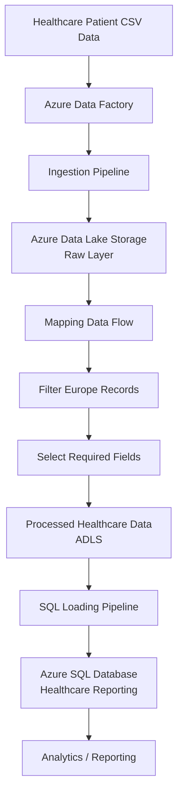
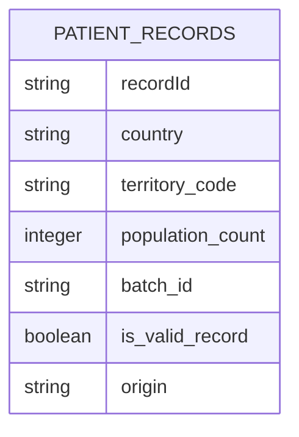

# Healthcare Data Lakehouse Platform

> A production-style Azure data engineering solution that ingests, transforms, and serves healthcare patient records using an automated cloud data pipeline architecture.

---

## Overview

The **Healthcare Data Lakehouse Platform** is an Azure-based data engineering project designed to build a scalable healthcare data processing workflow.

The project demonstrates an end-to-end data pipeline that:

* Ingests healthcare patient records from external sources
* Stores raw data in Azure Data Lake Storage
* Performs transformation and cleansing using Azure Data Factory Mapping Data Flows
* Applies business filtering logic
* Loads curated healthcare data into Azure SQL Database for reporting and analytics

The main goal of this project is to demonstrate a modern cloud data platform architecture following a layered data processing approach.

---

# Key Features

## Automated Data Ingestion

* Uses Azure Data Factory pipelines to ingest patient record datasets.
* Supports HTTP-based CSV ingestion.
* Stores raw healthcare data in Azure Data Lake Storage.

## Data Transformation Pipeline

Implemented using Azure Data Factory Mapping Data Flow:

* Reads raw patient records
* Filters healthcare records based on business rules
* Selects required attributes
* Writes processed data into curated storage

Implemented transformations:

* Europe-only healthcare record filtering
* Null validation on territory information
* Required column selection

## Data Lake Storage Architecture

The project follows a raw-to-processed data movement approach:

* Raw Layer → Original ingested files
* Processed Layer → Cleaned and transformed healthcare data
* Reporting Layer → SQL-ready analytics data

## Analytics Ready Data

Processed healthcare records are loaded into Azure SQL Database:

* Structured reporting tables
* Optimized for downstream analytics
* Supports reporting use cases

---

# Project Architecture

## High-Level Workflow

```
External Healthcare Dataset
            |
            |
            v
Azure Data Factory
            |
            |
            v
Raw Data Layer
(Azure Data Lake Storage)
            |
            |
            v
Mapping Data Flow
(Data Cleaning + Transformation)
            |
            |
            v
Processed Data Layer
(Azure Data Lake Storage)
            |
            |
            v
Azure SQL Database
(Healthcare Reporting)
```

---

## Mermaid Architecture Diagram



---

# Technology Stack

| Category            | Technology                           | Purpose                      |
| ------------------- | ------------------------------------ | ---------------------------- |
| Cloud Platform      | Microsoft Azure                      | Cloud data platform          |
| Data Orchestration  | Azure Data Factory                   | Pipeline automation          |
| Storage             | Azure Data Lake Storage Gen2         | Data lake storage            |
| Data Transformation | Azure Data Factory Mapping Data Flow | Data processing              |
| Database            | Azure SQL Database                   | Reporting storage            |
| Data Format         | CSV / Delimited Text                 | Source data format           |
| Development Format  | JSON ARM definitions                 | Azure resource configuration |
| Version Control     | Git                                  | Source management            |

---

# Project Structure

```
healthcare-data-lakehouse-platform-main/

│
├── dataflow/
│   └── df_transform_patients_record.json
│       └── Mapping Data Flow transformation logic
│
├── dataset/
│   ├── Patients_record.csv
│   │   └── Sample healthcare dataset
│   │
│   ├── ds_patients_record_raw_csv_http.json
│   │   └── HTTP source dataset configuration
│   │
│   ├── ds_patients_record_raw_csv_dl.json
│   │   └── Data Lake raw dataset configuration
│   │
│   ├── ds_processed_healthcare.json
│   │   └── Processed layer dataset configuration
│   │
│   └── ds_sql_healthcare.json
│       └── SQL destination dataset configuration
│
├── linkedService/
│   ├── LS_http_healthcare_reporting.json
│   │   └── HTTP connection configuration
│   │
│   ├── LS_adls_healthcarereportingdl.json
│   │   └── Azure Data Lake connection
│   │
│   └── ls_sql_healthcare_db.json
│       └── Azure SQL connection
│
├── pipeline/

│   ├── pipeline_ingest_patients_record_data.json
│   │   └── Raw data ingestion pipeline
│   │
│   ├── pipeline_healthcare_data.json
│   │   └── Transformation execution pipeline
│   │
│   └── pipeline_sql_healthcare_data.json
│       └── SQL loading pipeline
│
├── factory/
│   └── healthcare-reporting-adf-account.json
│       └── Azure Data Factory definition
│
└── publish_config.json
    └── Deployment publishing configuration
```

---

# How It Works

## Step 1 — Data Ingestion

The ingestion pipeline:

`pipeline_ingest_patients_record_data`

performs:

1. Reads patient CSV data from HTTP source
2. Uses Azure Data Factory Copy Activity
3. Writes raw data into Azure Data Lake Storage

Flow:

```
HTTP CSV Source
        |
        v
ADF Copy Activity
        |
        v
ADLS Raw Storage
```

---

## Step 2 — Data Transformation

Pipeline:

`pipeline_healthcare_data`

executes:

`df_transform_patients_record`

Transformation process:

1. Reads raw patient records
2. Filters records:

```
mainland == 'Europe'
AND
territory_code IS NOT NULL
```

3. Selects required columns
4. Writes processed healthcare records

---

## Step 3 — Reporting Data Load

Pipeline:

`pipeline_sql_healthcare_data`

Process:

1. Reads processed healthcare files from ADLS
2. Loads data into Azure SQL Database
3. Clears previous reporting table before insert

SQL operation:

```sql
TRUNCATE TABLE healthcare_reporting.patients_record;
```

---

# Installation & Setup

## Requirements

Required:

* Azure Subscription
* Azure Data Factory
* Azure Data Lake Storage Gen2
* Azure SQL Database
* Git

---

## Deployment Steps

### 1. Clone Repository

```bash
git clone <repository-url>

cd healthcare-data-lakehouse-platform-main
```

---

### 2. Create Azure Resources

Create:

* Azure Data Factory
* Azure Storage Account
* ADLS Gen2 containers
* Azure SQL Database

---

### 3. Configure Linked Services

Update:

```
linkedService/
```

with:

* Storage connection details
* SQL connection details
* Source connection details

---

### 4. Deploy Pipelines

Import:

```
pipeline/
```

files into Azure Data Factory.

Deploy:

* ingestion pipeline
* transformation pipeline
* SQL loading pipeline

---

# Usage Guide

Execution order:

```
1. Run ingestion pipeline

        ↓

2. Validate raw data in ADLS

        ↓

3. Run transformation pipeline

        ↓

4. Validate processed data

        ↓

5. Run SQL loading pipeline

        ↓

6. Query reporting database
        ↓

7. Visualize data in Power Bi dashboards & reports
```

---

# Database Design

## Healthcare Reporting Table

Target table:

```
healthcare_reporting.patients_record
```

Expected attributes include:

| Column           | Description              |
| ---------------- | ------------------------ |
| recordId         | Unique record identifier |
| country          | Healthcare country       |
| territory_code   | Region identifier        |
| population_count | Population value         |
| batch_id         | Processing batch         |
| is_valid_record  | Data quality indicator   |
| origin           | Data source              |

---

## Database Flow Diagram



---

# Code Quality & Engineering Practices

## Modular Architecture

Project separates:

* Pipelines
* Datasets
* Linked Services
* Transformations
* Factory configuration

This improves maintainability.

---

## Data Quality Handling

Implemented:

* Schema mapping
* Null validation
* Record filtering
* Type conversion handling

---

## Scalability

The architecture supports:

* Increasing data volume
* Additional transformation stages
* More reporting destinations

---

# Challenges & Solutions

## Challenge 1: Managing Raw and Processed Data

### Solution

Implemented separate data layers:

```
Raw → Processed → Reporting
```

which improves governance and traceability.

---

## Challenge 2: Data Cleaning

### Solution

Used Azure Data Factory Mapping Data Flow transformations for automated cleansing.

---

## Challenge 3: Reliable Data Movement

### Solution

Implemented independent pipelines for:

* ingestion
* transformation
* database loading

---

# Future Improvements

Possible enhancements:

* Add Azure Databricks for advanced transformations
* Implement Delta Lake storage
* Add Azure Key Vault for secrets management
* Add monitoring with Azure Monitor
* Add CI/CD deployment using Azure DevOps
* Implement data quality framework
* Add Power BI healthcare dashboards

---

# Screenshots / Demo

Add project screenshots:

## Architecture Diagram

https://github.com/PriyaRamteke/healthcare-data-lakehouse-platform/blob/main/images/architecture.png

## Azure Data Factory Pipeline

https://github.com/PriyaRamteke/healthcare-data-lakehouse-platform/tree/main/images/data%20factory%20pipeline

## Data Flow Execution

https://github.com/PriyaRamteke/healthcare-data-lakehouse-platform/blob/main/images/FLOW%20DIAGRAM.png


# Contributing

Contributions are welcome.

Steps:

1. Fork the repository
2. Create a feature branch

```bash
git checkout -b feature/new-feature
```

3. Commit changes

```bash
git commit -m "Add new feature"
```

4. Push changes

```bash
git push origin feature/new-feature
```

5. Create a Pull Request

---

# License

This project is available under the MIT License.

---

# Author

**PRIYA RAMTEKE**

Cloud Data Engineer | Azure Data Engineering | Data Lakehouse Development

GitHub:

https://github.com/PriyaRamteke


LinkedIn:

https://www.linkedin.com/in/priyaborkar10/

